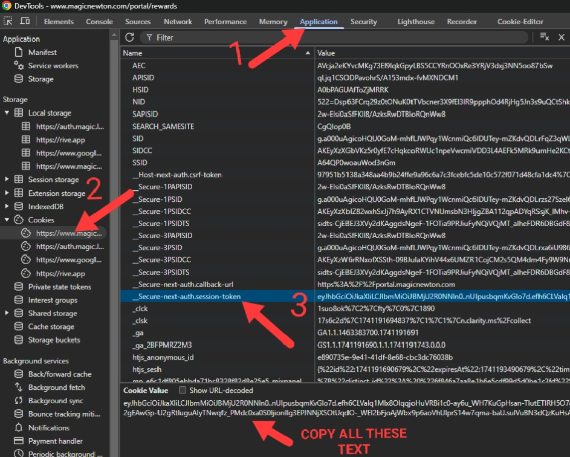

## Magic newton
 
## 🚨 Attention Before Running Magic Cli Version

## Magic Node cli version Script features

- Auto roll
- Auto social quest
- Support proxy or not
- Mutiple threads, multiple accounts

## RUNNING

- Clone Repository

```bash
git clone https://github.com/Not-D4rkCipherX/MagicNewton.git
cd MagicNewton
```

- Install Dependency

```bash
npm install
```

- Setup config in .env if needed to customize options then

```bash
nano .env
```

## Proxy (optional): http://user:pass@ip:port

```bash
nano proxy.txt
```

## Cookies: how to get cookies => 
- Open ``https://www.magicnewton.com/portal/rewards`` in your browser and login
- Press F12 or open developer option and then follow this screenshot

- Insert your account details in ``data.txt``,

```bash
nano data.txt
```

- Run the script

```bash
node main.js
```
